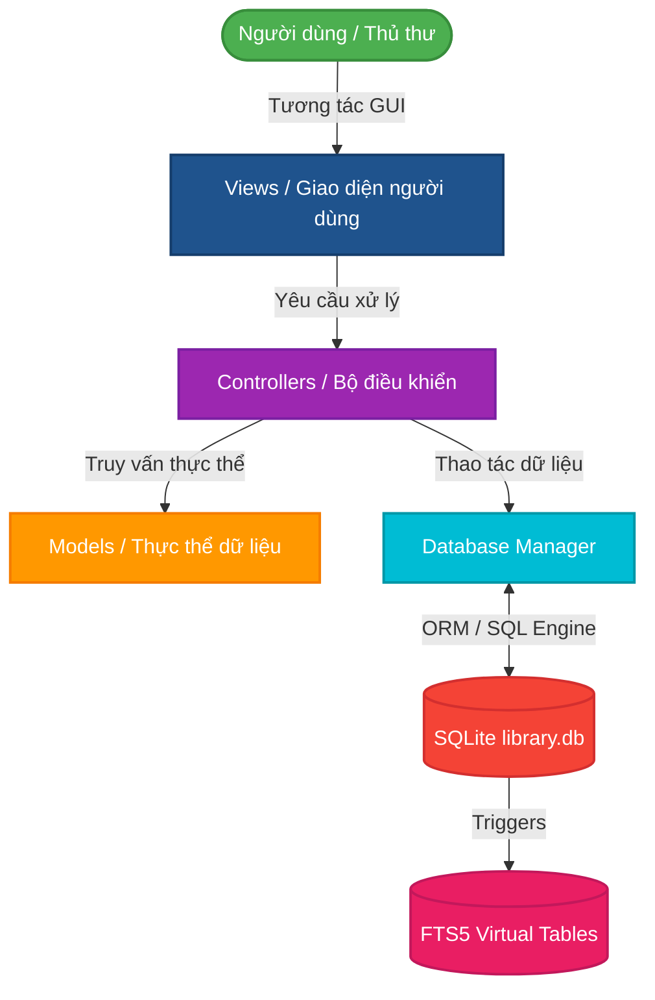

# 📚 LMS-PRO X: Hệ Thống Quản Lý Thư Viện Cao Cấp (Premium Library Management System)

<div align="center">
  
  
  
  
  
</div>

---

**LMS-PRO X** là một phần mềm Desktop quản lý thư viện chuyên nghiệp, hiệu năng cao được xây dựng trên nền tảng ngôn ngữ Python. Ứng dụng sở hữu giao diện tối tân, tối ưu hóa trải nghiệm người dùng với chế độ tối (Dark Mode) thời thượng, kiến trúc chuẩn MVC (Model-View-Controller) khép kín, cùng hệ thống tìm kiếm toàn văn siêu tốc và bộ thống kê dữ liệu trực quan cực kỳ mạnh mẽ.

---

## ✨ Các Tính Năng Nổi Bật

### 💻 1. Giao diện Desktop Hiện đại & Tốc độ Cao (Premium Dark GUI)
*   **CustomTkinter Engine:** Giao diện phẳng hiện đại, đồng bộ tối đa với chế độ Dark Mode tinh tế giúp chống mỏi mắt cho cán bộ thư viện trong thời gian dài làm việc.
*   **Hiển thị Lô Dữ Liệu Khổng Lồ (Batch Rendering):** Ứng dụng sử dụng kỹ thuật ẩn khung nhìn tạm thời (`grid_forget`) kết hợp chèn dữ liệu theo lô (`insert_batch`). Giúp tải hiển thị hàng vạn bản ghi lên bảng dữ liệu (Data Table) chỉ trong chớp mắt mà không gây đơ, lag giao diện.
*   **Thanh điều hướng Side-bar:** Quản lý chuyển đổi mượt mà giữa các tab chức năng kết hợp các hoạt ảnh nhẹ nhàng.

### 🔍 2. Công nghệ Tìm kiếm Toàn văn Tiên tiến (Advanced FTS5 Engine)
*   **SQLite FTS5 Integration:** Tìm kiếm thông tin Sách, Sinh viên và Phiếu mượn tức thời thông qua máy ảo tìm kiếm toàn văn tích hợp sẵn trong SQLite.
*   **Tìm kiếm không dấu (Accent-Insensitive Search):** Tích hợp thư viện `unidecode` để tạo hàm SQLite tùy biến `unaccent()`. Người dùng có thể tìm kiếm không dấu siêu tốc.
*   **Đồng bộ tự động bằng Database Triggers:** Mọi thay đổi dữ liệu được đồng bộ sang bảng ảo FTS5 hoàn toàn thông minh.

### 📊 3. Thống kê & Phân Tích Thuật Toán Tối Ưu (Real-time Analytics)
*   **Loop Fusion & Vectorization:** Các vòng lặp thống kê dữ liệu được hợp nhất, loại bỏ hoàn toàn hiện tượng thắt nút cổ chai do generator. Tốc độ chuyển sang Tab Thống Kê tức thời dù dữ liệu cực kỳ lớn.
*   **8 Chỉ số KPI thư viện chính:** Cập nhật ngay lập tức Tổng số sách, Tổng số sinh viên, Tổng lượt mượn, Tỷ lệ quá hạn, Số phiếu mượn/trả v.v.
*   **4 Biểu đồ trực quan Matplotlib:** Top sách được mượn, Tỷ lệ thể loại sách, Tình trạng sách trong kho và Xu hướng mượn sách theo tháng.

### 📁 4. Tích hợp Import/Export Excel Cao Cấp
*   **Nhập Liệu Đa Luồng (Threaded Bulk Import):** Tính năng nhập hàng nghìn sinh viên/sách từ file Excel. Xử lý diễn ra hoàn toàn ở luồng nền (background thread), đi kèm thanh tiến trình động (`ProgressBar`) mượt mà không làm treo ứng dụng.
*   **Tải Mẫu File Trắng (Template Generator):** Chế độ hộp thoại thông minh cho phép người dùng tự động sinh và tải về file Excel mẫu đã định dạng sẵn các tiêu đề chuẩn trước khi nhập liệu.
*   **Trích xuất Báo cáo 1-Click:** Xuất toàn bộ dữ liệu báo cáo sang file `Library_Report.xlsx` dễ dàng thông qua Pandas.

### ⚙️ 5. Trình Gỡ Lỗi Thông Minh (Smart Trace Logger)
*   Hệ thống Trace profiling chuyên nghiệp hỗ trợ bám sát từng lời gọi hàm.
*   **Cơ chế Lọc Nhiễu:** Tự động nhận diện và bỏ qua các hàm sinh viên dịch nội bộ (`<genexpr>`, `<listcomp>`, `<lambda>`) giúp giải phóng hoàn toàn hiệu suất hệ thống.
*   **Chế Độ DevMode:** Bộ ghi log chỉ được phép khởi chạy khi cố tình chạy lệnh `python main.py devmode`. Ở môi trường Production chạy thông thường, phần mềm đạt tốc độ và hiệu suất nguyên bản 100%.

---

## 🛠 Công Nghệ Sử Dụng (Tech Stack)

| Phân lớp (Layer) | Công nghệ chính | Vai trò trong dự án |
| :--- | :--- | :--- |
| **Giao diện (UI)** | `CustomTkinter` | Thiết kế giao diện máy tính hiện đại, đồng bộ hóa Dark Mode. |
| **Đa Luồng (Threading)**| `threading` | Chạy nền quá trình nhập xuất dữ liệu khổng lồ (Import/Export). |
| **Cơ sở dữ liệu** | `SQLite 3` | Lưu trữ dữ liệu cục bộ an toàn, FTS5 tìm kiếm toàn văn. |
| **Tương tác DB** | `SQLAlchemy` | Công cụ ORM mạnh mẽ quản lý schema, giao dịch (transactions). |
| **Xử lý số liệu** | `Pandas` | Biến đổi cấu trúc, phân tích số liệu thống kê và đọc ghi Excel. |
| **Vẽ đồ thị** | `Matplotlib` | Tạo lập đồ thị chuyên sâu và tích hợp trực tiếp lên giao diện Tkinter. |
| **Trình theo dõi (Trace)**| `sys.setprofile`| Hệ thống Trace Logger phân tích các hàm thắt cổ chai hiệu năng. |

---

## 📐 Kiến Trúc Luồng Dữ Liệu (Architecture & Flow)

Dưới đây là mô hình luồng hoạt động chuẩn MVC của hệ thống **LMS-PRO X**:



---

## 🚀 Hướng Dẫn Cài Đặt & Sử Dụng

### 1. Khởi tạo và Kích hoạt Môi trường ảo (Virtual Environment)
```bash
# Di chuyển vào thư mục dự án và khởi tạo .venv
python -m venv .venv

# Kích hoạt môi trường ảo (Hệ điều hành Windows)
.venv\Scripts\activate

# Kích hoạt môi trường ảo (macOS / Linux)
source .venv/bin/activate
```

### 2. Cài đặt các Thư viện phụ thuộc
```bash
pip install -r requirements.txt
```

### 3. Nạp dữ liệu mẫu thử nghiệm (Database Seeding)
Chạy tệp `seed_db.py` để sinh ngay lập tức **1,000 sinh viên**, **100 đầu sách** và **3,000 phiếu mượn trả**. 
```bash
python seed_db.py
```
> [!NOTE]
> Database cũ sẽ bị xóa sạch, mang lại một database hoàn toàn mới. Dữ liệu cực kỳ chân thực (tên tiếng Việt, số điện thoại, thể loại đầy đủ).

### 4. Khởi chạy Ứng dụng chính
Chạy môi trường Production (Hiệu năng cực cao - Không có Debugger cản trở):
```bash
python main.py
```

Chạy môi trường Phát triển (Kích hoạt Logger để phân tích thời gian chạy các hàm nội bộ):
```bash
python main.py devmode
# Hoặc
python main.py --devmode
```

---

## 💡 Hướng Dẫn Sử Dụng Nhanh cho Thủ Thư

1.  **Theo dõi Thống kê (Dashboard):** Click Tab **Thống kê & Phân tích** để kiểm tra ngay biểu đồ tình hình thư viện bằng thuật toán cực nhanh.
2.  **Quản lý & Nhập liệu Nhanh:** 
    *   Hỗ trợ tìm kiếm không dấu trực tiếp cực mạnh.
    *   Sử dụng nút **Nhập từ Excel** -> Nhấn **Tải file mẫu trắng** để lấy biểu mẫu chuẩn -> Chọn File đã điền để nhập hàng nghìn bản ghi lên cơ sở dữ liệu nền, không treo phần mềm.
3.  **Tạo Phiếu Mượn mới & Trả sách:** Quản lý ngày tháng lịch biểu trực quan bằng component `tkcalendar`. Mọi trạng thái sách sẽ được cập nhật đồng bộ (`Available`, `Borrowed`, `Overdue`).
4.  **Xuất file Báo cáo:** Click nút **Xuất dữ liệu ra Excel** ở Sidebar. File `Library_Report.xlsx` sẽ tự động tạo ra thư mục làm việc hiện tại.

---

## 🤝 Đội Ngũ Phát Triển (Credits)

Dự án được hoàn thiện dưới sự định hướng chuyên môn sâu sắc:

*   **Giảng viên Hướng dẫn:** ThS. Vũ Duy Sơn
*   **Thành viên thực hiện:**
    *   👨‍💻 **Bùi Ngọc Lâm**
    *   👨‍💻 **Đỗ Mạnh Cường**
    *   👨‍💻 **Đặng Minh Thành**
    *   👨‍💻 **Nguyễn Văn Tuấn**

---

## 📄 Giấy Phép (License)

Dự án được phân phối dưới giấy phép nguồn mở **MIT License**. Bạn được tự do học tập, nghiên cứu và phát triển thương mại phi lợi nhuận.

---
<p align="center">
  Chúc bạn có những trải nghiệm tuyệt vời cùng <b>LMS-PRO X</b>! 🚀
</p>
